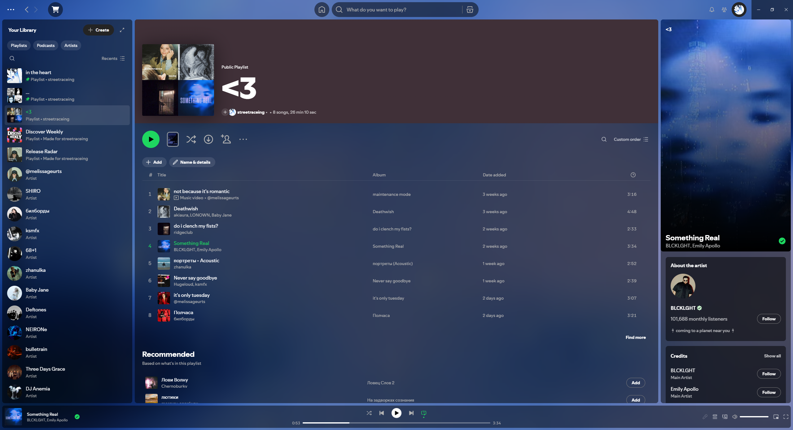

# Luminous

> A lightweight dynamic [Spicetify](https://spicetify.app/) theme with glass surfaces, adaptive album-art effects, and Spotify Canvas support.

<p align="center">
  
</p>

<p align="center">
  <a href="https://spicetify.app/docs/customization/marketplace">Spicetify Marketplace</a>
  ·
  <a href="https://youtu.be/S-2u6xTFZCs">Video preview</a>
  ·
  <a href="./docs/README.md">Documentation</a>
</p>

Luminous transforms Spotify's default interface into a softly lit, translucent workspace. The current cover automatically shapes a matching colour scene, while Spotify Canvas or a visible Now Playing video can replace the static artwork when available.

<details>
  <summary><strong>Animated preview</strong></summary>
  <br />
  
</details>

## Highlights

- Dynamic backgrounds from cover art, Canvas, and Spotify NPV videos.
- Adaptive effects derived from each cover's colours, contrast, and brightness.
- Stable Still, Drift, and Float background motion with adjustable speed.
- Four built-in presets: Balanced, Cinematic, Calm, and Performance.
- Adjustable backdrop blur and brightness, glass opacity and blur, effect intensity, and reduced motion.
- A focused settings dialog in Spotify's top bar with dedicated Presets, Appearance, Motion, and Advanced tabs.
- Built-in diagnostics for copying a reproducible runtime report when troubleshooting.
- Graceful fallbacks when artwork, video capture, or Spotify UI elements are unavailable.
- No runtime dependencies bundled with the theme.

## Install

The simplest option is to install **Luminous** from the [Spicetify Marketplace](https://spicetify.app/marketplace/). For local development or manual installation, use the workflow below.

### Requirements

- [Spicetify](https://spicetify.app/) 2.44.0 or later.
- Node.js 22.13+ on the 22.x LTS line, or Node.js 24+ with npm for building from source.
- Spotify desktop app with Spicetify already configured.

### Build from source

```bash
git clone https://github.com/streetraceing/luminous.git
cd luminous
npm install
npm run build
```

### Apply the local build

```bash
npm run apply
```

This builds the theme, selects `Luminous` as the current Spicetify theme, and applies it to Spotify.

### Revert to the Marketplace theme

```bash
npm run revert
```

## Development

| Command                  | Purpose                                                                |
| ------------------------ | ---------------------------------------------------------------------- |
| `npm run check`          | Run TypeScript, ESLint, and production build validation.               |
| `npm run typecheck`      | Validate TypeScript without writing files.                             |
| `npm run lint:check`     | Validate JavaScript and TypeScript with ESLint.                        |
| `npm run lint:fix`       | Apply ESLint fixes where possible.                                     |
| `npm run build`          | Create the distributable files in `dist/`.                             |
| `npm run watch`          | Ask Spicetify to watch the active theme.                               |
| `npm run prettier:write` | Format project files with Prettier.                                    |
| `npm run release`        | Build release artifacts and try a Git commit with the current version. |

## Documentation

- [Using and customising Luminous](./docs/customization.md)
- [Technical architecture](./docs/architecture.md)
- [Troubleshooting](./docs/troubleshooting.md)

## License

Distributed under the [MIT License](./LICENSE).
